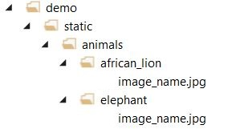

# Species Classification API Demo


## Overview

This demo uses the AI for Earth Species Classification API, which identifies over 5,000 plant and animal species. <br/>
Visit the [API home page](https://www.microsoft.com/en-us/ai/ai-for-earth-apis) for more information or to request an API key. 
The code used to train our model is available [here](https://github.com/Microsoft/SpeciesClassification).

You can view the live demo at [aka.ms/speciesclassification](http://aka.ms/speciesclassification)


## Setup Instructions

The demo was tested on an Azure VM with the following configuration:
* Operating system: Linux (ubuntu 18.04)
* Size: Standard B2ms (2 vcpus, 8 GiB memory)


### Clone the repository and update the config file

- Clone the repository and copy the folder `demo` to your local machine or server
- Open the demo folder and open the config file `config.py` (demo/config.py)
- Update the variable `ROOT_PATH` with the path to the demo on your local machine or server (e.g `/home/.../demo`)
- Update the variable `BASE_URL` with the base URL for the API (e.g `https://api-base-url/`). Refer to the API documentation for information 
- Update the variable `SUBSCRIPTION_KEY` with your product / API key. Visit the [API home page](https://www.microsoft.com/en-us/ai/ai-for-earth-apis) for more information on how to request an API key


### Add the sample images

* Navigate to the folder `demo/static` and create a directory called `animals`
* Inside the newly created directory `animals` add the sample images that you would like to be displayed in the demo site.
   The directory structure for the sample images should be as follows `animal_name > image.ext` as shown in the example below
   
   <b>Note: a minimum of 8 valid images (jpg or png) is required for the demo to work</b>

<p></p>
  
* Next run the python code `setup_sample_images.py` (demo/setup_sample_images.py). 
  This script does the following:
  - Renames the files/directories to remove invalid characters.
  - Creates a csv index file called `demo/static/data/updated_animal_list.csv` - the csv file contains the file paths and      corresponding animal names. ( extracted from the directory names )
  - Creates a thumbnails folder from the provided images. ( resized images from the animals folder, these are the images
  that are displayed on the site, while predicting the site will look up the corresponding image in the animals folder)

### Run the demo

* Install the following packages by running the commands listed below:

```
pip install Flask==1.1.1
pip install requests==2.22.0
pip install urllib3==1.25.3
pip install pandas==0.24.2
pip install Pillow==6.1.0
```

- To start the demo run the code file `app.py`(demo/app.py) (python app.py)
- In a browser navigate to `http://<your VM address>:5000`

